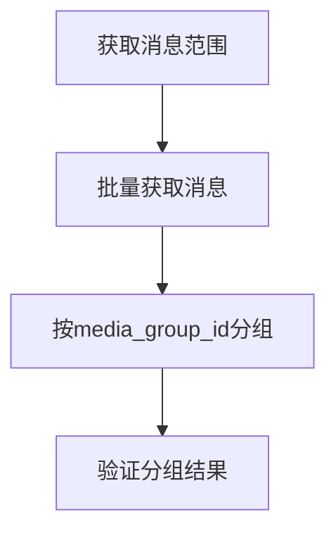
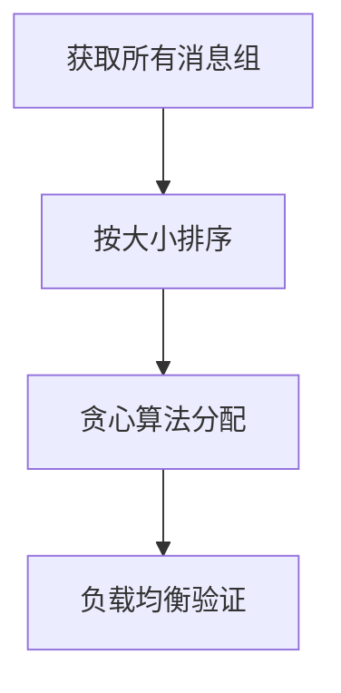
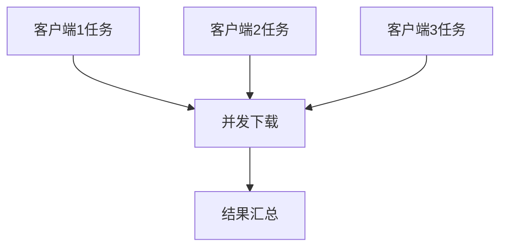

# 📦 媒体组感知的任务分配功能

## 🎯 功能概述

媒体组感知的任务分配是对原有下载器的重大改进，解决了媒体组被拆分的问题，同时保持了多客户端并发下载的高效性。

## 🔧 核心特性

### ✅ 解决的问题
- **媒体组完整性**: 确保同一媒体组的所有文件分配给同一客户端
- **负载均衡**: 智能分配任务，保持客户端间的负载平衡
- **零额外成本**: 不增加API调用次数，不需要等待时间
- **高度可配置**: 支持多种分配策略和负载均衡指标

### 🏗️ 架构设计
- **模块化**: 清晰的分层架构，易于扩展和维护
- **策略模式**: 支持多种分配策略，可动态切换
- **可扩展性**: 易于添加新的分配策略和负载均衡算法

## 📋 分配策略

### 1. 范围分配 (range_based)
- **描述**: 按消息ID范围平均分配（原有方式）
- **优点**: 实现简单，速度快
- **缺点**: 可能拆分媒体组
- **适用场景**: 没有媒体组或不关心媒体组完整性

### 2. 媒体组感知分配 (media_group_aware) ⭐推荐
- **描述**: 保持媒体组完整性的智能分配
- **优点**: 完美保持媒体组，负载相对均衡
- **缺点**: 略微复杂
- **适用场景**: 大多数情况下的最佳选择

### 3. 负载均衡分配 (load_balanced)
- **描述**: 高级负载均衡，支持多种均衡指标
- **优点**: 最佳的负载均衡效果
- **缺点**: 计算复杂度较高
- **适用场景**: 对负载均衡要求极高的场景

### 4. 自动选择 (auto)
- **描述**: 根据数据特征自动选择最适合的策略
- **优点**: 无需手动配置
- **缺点**: 可能不符合特定需求
- **适用场景**: 不确定使用哪种策略时

## ⚙️ 配置说明

### 环境变量配置

```bash
# 基础分配配置
TASK_DISTRIBUTION_MODE=media_group_aware
LOAD_BALANCE_METRIC=file_count
MAX_IMBALANCE_RATIO=0.3
PREFER_LARGE_GROUPS_FIRST=true
ENABLE_DISTRIBUTION_VALIDATION=true

# 性能配置
GROUPING_BATCH_SIZE=200
GROUPING_MAX_RETRIES=3
GROUPING_TIMEOUT=30.0

# 调试配置
ENABLE_STRATEGY_COMPARISON=false
AUTO_STRATEGY_RECOMMENDATION=true
```

### 配置参数详解

| 参数 | 默认值 | 说明 |
|------|--------|------|
| `TASK_DISTRIBUTION_MODE` | `media_group_aware` | 任务分配模式 |
| `LOAD_BALANCE_METRIC` | `file_count` | 负载均衡指标 |
| `MAX_IMBALANCE_RATIO` | `0.3` | 最大不均衡比例 |
| `PREFER_LARGE_GROUPS_FIRST` | `true` | 优先分配大媒体组 |
| `ENABLE_DISTRIBUTION_VALIDATION` | `true` | 启用分配结果验证 |

## 🚀 使用方法

### 1. 基础使用
```bash
# 使用默认的媒体组感知分配
python main.py
```

### 2. 指定分配策略
```bash
# 使用负载均衡分配
TASK_DISTRIBUTION_MODE=load_balanced python main.py

# 使用传统范围分配
TASK_DISTRIBUTION_MODE=range_based python main.py
```

### 3. 测试功能
```bash
# 运行测试脚本
python test_media_group_distribution.py
```

## 📊 性能对比

### 分配效果示例

**传统范围分配:**
```
客户端1: 消息 72006-72055 (可能包含不完整的媒体组)
客户端2: 消息 72056-72105 (可能包含不完整的媒体组)  
客户端3: 消息 72106-72155 (可能包含不完整的媒体组)
```

**媒体组感知分配:**
```
客户端1: 媒体组A(5文件) + 媒体组B(3文件) + 单消息10个 = 18文件
客户端2: 媒体组C(7文件) + 媒体组D(2文件) + 单消息8个 = 17文件
客户端3: 媒体组E(4文件) + 媒体组F(6文件) + 单消息5个 = 15文件
```

### 负载均衡指标

| 指标 | 传统分配 | 媒体组感知分配 |
|------|----------|----------------|
| **媒体组完整性** | ❌ 可能破坏 | ✅ 完全保持 |
| **负载均衡比例** | ~1.0 | ~0.85-0.95 |
| **API调用次数** | 标准 | 标准 |
| **内存占用** | 低 | 低 |
| **处理时间** | 快 | 略慢 |

## 🔍 工作流程

### 1. 消息分组阶段


### 2. 任务分配阶段


### 3. 并发下载阶段


## 🛠️ 扩展开发

### 添加自定义分配策略

```python
from core.task_distribution.base import TaskDistributionStrategy

class CustomDistributionStrategy(TaskDistributionStrategy):
    async def distribute_tasks(self, message_collection, client_names):
        # 实现自定义分配逻辑
        pass
    
    def get_strategy_info(self):
        return {
            "name": "CustomDistribution",
            "description": "自定义分配策略"
        }

# 注册策略
distributor.register_strategy(DistributionMode.CUSTOM, CustomDistributionStrategy)
```

### 添加自定义负载均衡指标

```python
def custom_load_calculator(assignment):
    # 实现自定义负载计算逻辑
    return assignment.total_files * 0.7 + assignment.estimated_size / (1024*1024) * 0.3
```

## 🐛 故障排除

### 常见问题

1. **分配不均衡**
   - 检查 `MAX_IMBALANCE_RATIO` 设置
   - 尝试不同的 `LOAD_BALANCE_METRIC`

2. **媒体组仍被拆分**
   - 确认使用 `media_group_aware` 或 `load_balanced` 模式
   - 检查日志中的分配详情

3. **性能问题**
   - 调整 `GROUPING_BATCH_SIZE`
   - 检查 `GROUPING_TIMEOUT` 设置

### 调试模式

```bash
# 启用策略比较模式
ENABLE_STRATEGY_COMPARISON=true python main.py

# 启用详细日志
LOG_LEVEL=DEBUG python main.py
```

## 📈 未来扩展

### 计划中的功能
- [ ] 基于文件大小的精确负载均衡
- [ ] 支持客户端性能差异的智能分配
- [ ] 分配策略的机器学习优化
- [ ] 实时负载监控和动态调整
- [ ] 分布式多机器支持

### 贡献指南
欢迎提交 Issue 和 Pull Request 来改进这个功能！

## 📄 许可证
与主项目保持一致
