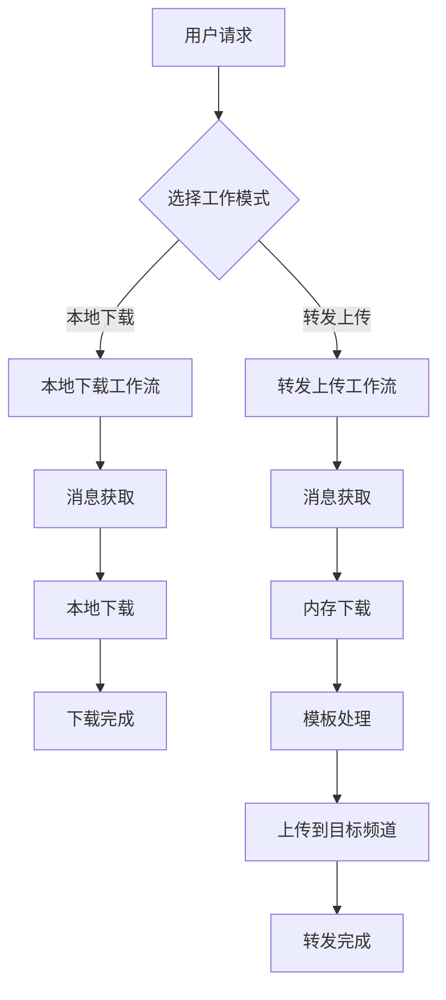

# Telegram 上传模块架构设计文档

## 📋 项目概述

基于现有的多客户端 Telegram 下载器，扩展实现上传功能。项目将支持两种独立的工作模式：

1. **本地下载模式** - 纯下载功能，将感兴趣的消息下载到本地
2. **转发上传模式** - 内存下载 + 模板处理 + 上传到目标频道

## 🏗️ 整体架构设计

### 核心工作流程



### 模块依赖关系

```
WorkflowManager (工作流管理器)
├── LocalDownloadWorkflow (本地下载工作流)
│   ├── MessageFetcher (消息获取器) [现有]
│   └── DownloadManager (下载管理器) [扩展]
│       └── LocalDownloader [现有]
│
└── ForwardWorkflow (转发工作流)
    ├── MessageFetcher (消息获取器) [现有]
    ├── DownloadManager (下载管理器) [扩展]
    │   └── MemoryDownloader [新增]
    ├── TemplateProcessor (模板处理器) [新增]
    └── UploadManager (上传管理器) [新增]
```

## 📁 新增模块结构

```
multiDownloadPyrogram/
├── core/
│   ├── download/
│   │   ├── memory_downloader.py     # 🆕 内存下载器
│   │   └── download_manager.py      # 🔄 扩展支持内存下载
│   ├── template/                    # 🆕 模板处理模块
│   │   ├── __init__.py
│   │   ├── template_engine.py       # 模板引擎核心
│   │   ├── template_processor.py    # 模板处理器
│   │   └── variable_extractor.py    # 变量提取器
│   ├── upload/                      # 🆕 上传模块
│   │   ├── __init__.py
│   │   ├── upload_manager.py        # 上传管理器
│   │   ├── upload_strategy.py       # 上传策略
│   │   └── batch_uploader.py        # 批量上传器
│   └── workflow/                    # 🆕 工作流模块
│       ├── __init__.py
│       ├── workflow_manager.py      # 工作流管理器
│       ├── local_download_workflow.py   # 本地下载工作流
│       └── forward_workflow.py      # 转发工作流
├── models/
│   ├── download_result.py           # 🆕 下载结果模型
│   ├── template_config.py           # 🆕 模板配置模型
│   ├── upload_task.py              # 🆕 上传任务模型
│   └── workflow_config.py          # 🆕 工作流配置模型
├── templates/                       # 🆕 模板文件目录
│   ├── default.txt                 # 默认模板
│   └── custom/                     # 自定义模板目录
└── config/
    └── settings.py                  # 🔄 扩展配置
```

## 🔧 核心功能设计

### 1. 本地下载模式

**功能描述**：

- 用户指定频道和消息范围
- 系统将媒体文件下载到本地目录
- 提供下载进度监控和统计

**工作流程**：

```python
# 本地下载工作流
async def local_download_workflow(config):
    # 1. 获取消息
    messages = await message_fetcher.fetch_messages(config.channel, config.message_range)

    # 2. 本地下载
    for message in messages:
        result = await download_manager.download_to_local(message)
        # 保存到本地文件系统

    # 3. 统计和报告
    return download_stats
```

### 2. 转发上传模式

**功能描述**：

- 用户指定源频道和目标频道
- 系统内存下载媒体文件
- 通过模板处理消息内容
- 上传到目标频道

**工作流程**：

```python
# 转发工作流
async def forward_workflow(config):
    # 1. 获取消息
    messages = await message_fetcher.fetch_messages(config.source_channel, config.message_range)

    # 2. 内存下载
    download_results = []
    for message in messages:
        result = await download_manager.download_to_memory(message)
        download_results.append(result)

    # 3. 模板处理
    processed_content = []
    for result in download_results:
        content = await template_processor.process(result, config.template)
        processed_content.append(content)

    # 4. 批量上传
    for content in processed_content:
        await upload_manager.upload_to_channel(content, config.target_channels)

    # 5. 统计和报告
    return forward_stats
```

## 📊 数据模型设计

### 工作流配置模型

```python
@dataclass
class WorkflowConfig:
    """工作流配置"""
    workflow_type: str  # "local_download" 或 "forward"

    # 通用配置
    source_channel: str
    message_range: Tuple[int, int]

    # 本地下载配置
    download_directory: Optional[str] = None

    # 转发配置
    target_channels: List[str] = field(default_factory=list)
    template_config: Optional[TemplateConfig] = None

    # 执行配置
    max_concurrent: int = 3
    enable_monitoring: bool = True
```

### 下载结果模型

```python
@dataclass
class DownloadResult:
    """下载结果"""
    message_id: int
    file_name: str
    file_size: int
    download_mode: str  # "local" 或 "memory"

    # 数据存储 (二选一)
    file_path: Optional[str] = None      # 本地文件路径
    file_data: Optional[bytes] = None    # 内存数据

    # 原始消息信息
    original_text: Optional[str] = None
    original_caption: Optional[str] = None
    media_group_id: Optional[str] = None
```

## 🎯 模板系统设计

### 模板模式

1. **原格式模式** (`ORIGINAL`)

   - 保持原始消息的文本和媒体
   - 不进行任何修改
   - 适用于简单转发

2. **自定义模板模式** (`CUSTOM`)
   - 使用用户定义的模板
   - 支持变量替换
   - 支持格式化和样式

### 内置变量

```python
BUILTIN_VARIABLES = {
    "original_text": "原始消息文本",
    "original_caption": "原始媒体说明",
    "file_name": "文件名",
    "file_size": "文件大小",
    "source_channel": "来源频道",
    "timestamp": "当前时间",
    "message_id": "消息ID"
}
```

### 模板示例

```markdown
# 默认模板

{original_text}
{original_caption}

# 自定义模板

📸 来自 {source_channel} 的精彩内容

{original_text}

📁 文件: {file_name} ({file_size})
🕒 转发时间: {timestamp}
```

## 🚀 实现计划

### Phase 1: 基础扩展 (1-2 周)

- [ ] 扩展下载管理器支持内存下载
- [ ] 创建基础数据模型
- [ ] 实现简单的工作流管理器
- [ ] 测试本地下载和内存下载功能

### Phase 2: 模板系统 (1 周)

- [ ] 实现模板引擎
- [ ] 支持变量提取和替换
- [ ] 创建默认模板
- [ ] 测试模板处理功能

### Phase 3: 上传功能 (1-2 周)

- [ ] 实现上传管理器
- [ ] 支持批量上传
- [ ] 集成上传进度监控
- [ ] 测试完整转发流程

### Phase 4: 集成优化 (1 周)

- [ ] 完善工作流协调
- [ ] 添加错误处理和重试
- [ ] 性能优化
- [ ] 完整功能测试

## 🌐 网页版扩展准备

### API 接口设计

```python
# 本地下载接口
POST /api/download/local
{
    "channel": "@source_channel",
    "message_range": [1000, 2000],
    "download_directory": "/path/to/downloads"
}

# 转发接口
POST /api/forward/start
{
    "source_channel": "@source_channel",
    "target_channels": ["@target1", "@target2"],
    "message_range": [1000, 2000],
    "template_config": {
        "mode": "custom",
        "content": "📸 {original_text}"
    }
}

# 模板管理接口
GET /api/templates/
POST /api/templates/
PUT /api/templates/{template_id}
DELETE /api/templates/{template_id}

# 任务状态接口
GET /api/tasks/{task_id}/status
GET /api/tasks/{task_id}/progress
```

### 前端页面设计

1. **下载页面**

   - 频道选择器
   - 消息范围设置
   - 下载目录选择
   - 下载进度显示

2. **转发页面**

   - 源频道和目标频道选择
   - 模板选择和编辑
   - 转发进度监控

3. **模板管理页面**

   - 模板列表和搜索
   - 模板编辑器
   - 变量预览

4. **监控页面**
   - 任务列表和状态
   - 实时进度更新
   - 统计图表

## 📈 性能和扩展性

### 性能优化

- 异步并发处理
- 内存使用优化
- 批量操作支持
- 智能重试机制

### 扩展性设计

- 模块化架构
- 插件式模板系统
- 可配置的处理策略
- API 优先的设计

### 监控和日志

- 详细的操作日志
- 性能指标收集
- 错误追踪和报告
- 实时状态更新

## 🔒 安全和稳定性

### 错误处理

- 网络异常重试
- 文件操作异常处理
- 内存溢出保护
- 优雅的降级策略

### 数据安全

- 敏感信息加密
- 临时文件清理
- 内存数据及时释放
- 访问权限控制

这个设计既满足了当前的功能需求，又为未来的网页版扩展做好了准备。通过清晰的模块分离和标准化的接口设计，可以方便地进行功能扩展和维护。

## 💻 具体实现指南

### 1. 扩展现有下载管理器

**修改 `core/download/download_manager.py`**：

```python
class DownloadManager(LoggerMixin):
    """扩展的下载管理器，支持本地和内存下载"""

    def __init__(self, config: DownloadConfig):
        self.config = config
        self.local_downloader = LocalDownloader()  # 现有
        self.memory_downloader = MemoryDownloader()  # 新增

    async def download_media(self, message, mode: str = "local") -> DownloadResult:
        """根据模式选择下载方式"""
        if mode == "local":
            return await self._download_to_local(message)
        elif mode == "memory":
            return await self._download_to_memory(message)
        else:
            raise ValueError(f"Unsupported download mode: {mode}")

    async def _download_to_memory(self, message) -> DownloadResult:
        """内存下载实现"""
        file_data = await self.memory_downloader.download(message)

        return DownloadResult(
            message_id=message.id,
            file_name=getattr(message.media, 'file_name', f"file_{message.id}"),
            file_size=getattr(message.media, 'file_size', 0),
            download_mode="memory",
            file_data=file_data,
            original_text=message.text,
            original_caption=message.caption
        )
```

### 2. 创建内存下载器

**新建 `core/download/memory_downloader.py`**：

```python
class MemoryDownloader(BaseDownloader):
    """内存下载器，将文件下载到内存中"""

    async def download(self, client: Client, message) -> bytes:
        """下载文件到内存"""
        try:
            # 使用 Pyrogram 的 download 方法，指定 in_memory=True
            file_data = await client.download_media(
                message,
                in_memory=True
            )

            if isinstance(file_data, bytes):
                return file_data
            else:
                # 如果返回的是文件路径，读取文件内容
                with open(file_data, 'rb') as f:
                    data = f.read()
                # 删除临时文件
                os.unlink(file_data)
                return data

        except Exception as e:
            self.log_error(f"内存下载失败: {e}")
            raise
```

### 3. 实现工作流管理器

**新建 `core/workflow/workflow_manager.py`**：

```python
class WorkflowManager(LoggerMixin):
    """工作流管理器"""

    def __init__(self, client_manager: ClientManager):
        self.client_manager = client_manager
        self.local_workflow = LocalDownloadWorkflow(client_manager)
        self.forward_workflow = ForwardWorkflow(client_manager)

    async def execute_workflow(self, config: WorkflowConfig) -> Dict[str, Any]:
        """执行工作流"""
        if config.workflow_type == "local_download":
            return await self.local_workflow.execute(config)
        elif config.workflow_type == "forward":
            return await self.forward_workflow.execute(config)
        else:
            raise ValueError(f"Unknown workflow type: {config.workflow_type}")
```

### 4. 用户配置示例

**配置文件示例**：

```python
# 本地下载配置
local_config = WorkflowConfig(
    workflow_type="local_download",
    source_channel="@source_channel",
    message_range=(1000, 2000),
    download_directory="./downloads/local",
    max_concurrent=3
)

# 转发配置
forward_config = WorkflowConfig(
    workflow_type="forward",
    source_channel="@source_channel",
    message_range=(1000, 2000),
    target_channels=["@target1", "@target2"],
    template_config=TemplateConfig(
        mode=TemplateMode.CUSTOM,
        content="📸 来自 {source_channel} 的内容\n\n{original_text}"
    ),
    max_concurrent=2
)
```

## 🔧 集成到现有项目

### 修改主程序 `main.py`

```python
class MultiClientDownloader:
    """扩展的多客户端下载器"""

    def __init__(self):
        # 现有初始化代码...
        self.workflow_manager = WorkflowManager(self.client_manager)

    async def run_workflow(self, config: WorkflowConfig):
        """运行指定的工作流"""
        try:
            # 初始化客户端
            await self._initialize_clients()

            # 执行工作流
            result = await self.workflow_manager.execute_workflow(config)

            # 打印结果
            self._print_workflow_results(result)

        except Exception as e:
            self.log_error(f"工作流执行失败: {e}")
        finally:
            await self._cleanup()

    # 保持现有的 run_download 方法向后兼容
    async def run_download(self):
        """现有的下载功能（向后兼容）"""
        # 现有代码保持不变...
```

### 命令行参数扩展

```python
def main():
    import argparse

    parser = argparse.ArgumentParser(description="多客户端Telegram工具")
    parser.add_argument("--mode", choices=["download", "forward"],
                       default="download", help="工作模式")
    parser.add_argument("--source", required=True, help="源频道")
    parser.add_argument("--targets", nargs="*", help="目标频道(转发模式)")
    parser.add_argument("--template", help="模板文件路径")
    parser.add_argument("--range", nargs=2, type=int, help="消息范围")

    args = parser.parse_args()

    if args.mode == "download":
        config = WorkflowConfig(
            workflow_type="local_download",
            source_channel=args.source,
            message_range=tuple(args.range) if args.range else (1, 100)
        )
    elif args.mode == "forward":
        config = WorkflowConfig(
            workflow_type="forward",
            source_channel=args.source,
            target_channels=args.targets or [],
            message_range=tuple(args.range) if args.range else (1, 100)
        )

    downloader = MultiClientDownloader()
    asyncio.run(downloader.run_workflow(config))
```

## 📋 开发检查清单

### Phase 1: 基础功能

- [ ] 创建 `DownloadResult` 数据模型
- [ ] 实现 `MemoryDownloader` 类
- [ ] 扩展 `DownloadManager` 支持内存下载
- [ ] 创建基础工作流框架
- [ ] 测试内存下载功能

### Phase 2: 模板系统

- [ ] 创建 `TemplateConfig` 数据模型
- [ ] 实现 `TemplateEngine` 核心功能
- [ ] 实现变量提取和替换
- [ ] 创建默认模板
- [ ] 测试模板处理功能

### Phase 3: 上传功能

- [ ] 创建 `UploadTask` 数据模型
- [ ] 实现 `UploadManager` 类
- [ ] 支持批量上传
- [ ] 集成进度监控
- [ ] 测试完整转发流程

### Phase 4: 集成测试

- [ ] 完整工作流测试
- [ ] 性能测试和优化
- [ ] 错误处理测试
- [ ] 文档更新

## 🎯 使用示例

### 本地下载示例

```bash
# 下载指定频道的消息到本地
python main.py --mode download --source @channel_name --range 1000 2000
```

### 转发上传示例

```bash
# 转发消息到目标频道
python main.py --mode forward --source @source_channel --targets @target1 @target2 --range 1000 1100
```

### Python API 使用

```python
# 本地下载
local_config = WorkflowConfig(
    workflow_type="local_download",
    source_channel="@source",
    message_range=(1000, 2000)
)

downloader = MultiClientDownloader()
await downloader.run_workflow(local_config)

# 转发上传
forward_config = WorkflowConfig(
    workflow_type="forward",
    source_channel="@source",
    target_channels=["@target1", "@target2"],
    message_range=(1000, 1100),
    template_config=TemplateConfig(
        mode=TemplateMode.CUSTOM,
        content="📸 {original_text}\n\n来源: {source_channel}"
    )
)

await downloader.run_workflow(forward_config)
```

这个设计提供了清晰的功能分离，既保持了现有功能的稳定性，又为新功能提供了良好的扩展性。
